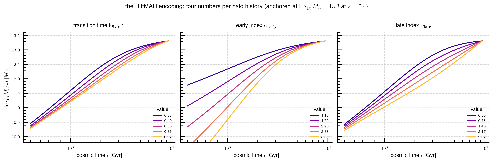
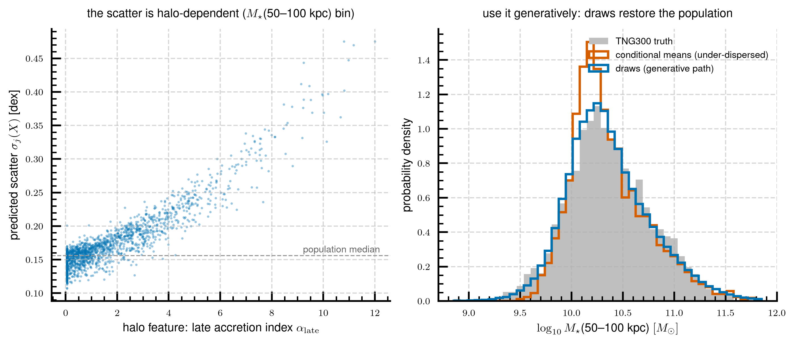
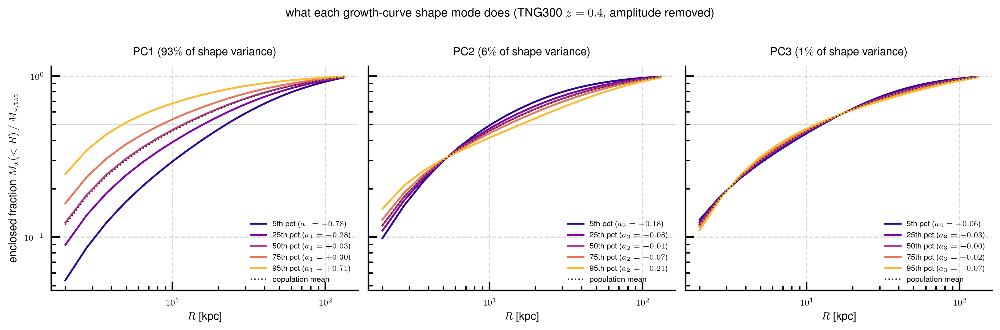
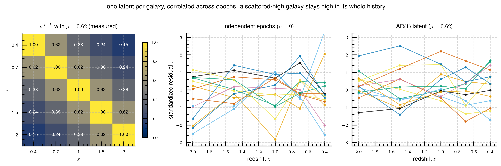
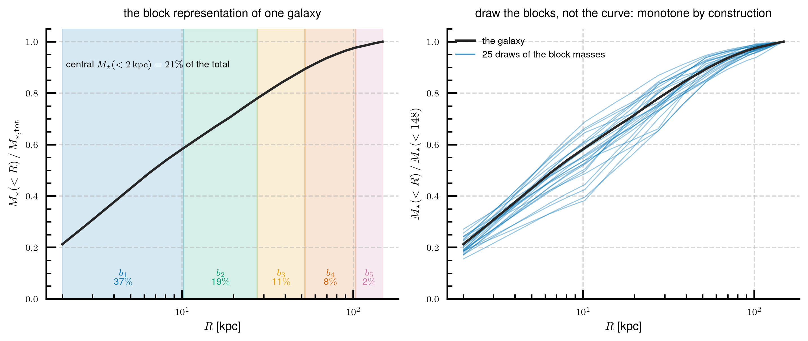

# Tech note 1 — The statistical emulator

*How we predict the stellar-mass profile of a massive central galaxy — and
its full evolution history — from five numbers describing its dark-matter
halo.*

This is the first of three notes documenting the project's two emulators.
This note covers the **statistical emulator**: a heteroscedastic conditional
Gaussian model that maps portable halo properties to the galaxy's stellar
mass distribution, at one epoch and across cosmic time. It is the project's
*accuracy and generative product* — the model you use when you want correct
masses, honest uncertainties, and mock populations. The second note covers
the physically-structured *transport kernel*; the third covers a documented
alternative kernel.

The implementation lives in three library modules, each a layer on the one
below:

| module | role |
|---|---|
| `hongshao/emulator.py` | the core: mean + heteroscedastic covariance over any target vector |
| `hongshao/profile_emulator.py` | profile targets: apertures, effective-radius bins, PCA-compressed full profiles |
| `hongshao/multi_epoch.py` | the multi-epoch generative product: continuous redshift, coherent histories |

Every module has a runnable self-check (`python -m hongshao.<module>`) that
reproduces the reference numbers quoted below. The training data are ~2,400
TNG300 central galaxies with halo peak mass $M_{\rm peak} > 10^{13}\,M_\odot$
at $z=0.4$, with stellar-mass profiles measured at the five snapshot epochs
$z = 0.4, 0.7, 1.0, 1.5, 2.0$.

---

## 1. The target: the curve of growth

The observable we model is the galaxy's **curve of growth** (CoG): the
cumulative stellar mass $M_\star(<R)$ inside projected radius $R$, measured
on a fixed 24-point grid from 2 to 148 kpc. We always work with its
logarithm,

$$
c(R) \;=\; \log_{10} M_\star(<R),
$$

which is smooth, monotone in $R$, and spans the population's ~2 dex of
amplitude range gracefully. The CoG is the observation-facing quantity:
aperture masses, half-mass radii, and (by differencing) surface-density
profiles all derive from it.

## 2. The inputs: five portable halo numbers

The model's features must exist in *any* simulation (and, in principle, be
inferable for observed halos) — nothing TNG-specific. We use

$$
X \;=\; \big[\, \log M_{\rm p},\; \log t_c,\; \alpha_{\rm early},\;
\alpha_{\rm late},\; c_{200c} \,\big].
$$

The first four are the **DiffMAH** parameters (Hearin et al. 2021,
arXiv:2105.05859) of the halo's mass accretion history (MAH). DiffMAH
describes the peak-mass history as a power law in cosmic time whose
logarithmic slope rolls smoothly from an early to a late value:

$$
\log_{10} M_h(t) = \log_{10} M_{\rm p} + \alpha(\log t)\,
\big(\log t - \log t_0\big),
\qquad
\alpha(\log t) = \alpha_{\rm early} +
\frac{\alpha_{\rm late} - \alpha_{\rm early}}
{1 + e^{-k(\log t - \log t_c)}},
$$

with the transition speed fixed at $k = 3.5$ and the anchor $t_0$ set to the
$z=0.4$ epoch, so $\log M_{\rm p}$ is (essentially) the halo mass at the
observation epoch. Each halo is therefore four numbers: a normalization, a
transition time, and two growth indices.



*Each panel varies one DiffMAH parameter across its population 5th–95th
percentile range (colors, purple to yellow) with the others held at the
sample medians. $\log t_c$ shifts **when** the growth slows;
$\alpha_{\rm early}$ sets how steeply the halo assembled at early times;
$\alpha_{\rm late}$ sets how much it still grows near the observation
epoch.*

The fifth feature is the NFW concentration $c_{200c} = R_{200c}/r_s$. It is
**not** redundant with the MAH even though it correlates with formation
time: adding it improves the prediction by ~5% in CRPS (defined below) on
top of the DiffMAH parameters, mostly through the mass normalization. It is
the only secondary halo property that earned a slot; richer feature sets
(accretion rate, halo shape, merger statistics) all failed to add
measurable value on top of this five-vector.

## 3. The core: a heteroscedastic conditional Gaussian

Given a target vector $Y \in \mathbb{R}^T$ (e.g. four log aperture masses;
later, a compressed profile), the core model is a Gaussian conditional
distribution

$$
P(Y \mid X) \;=\;
\mathcal{N}\!\big(\, \mu(X),\; \Sigma(X) \,\big),
$$

with three fitted ingredients:

**The mean.** Per target $j$, a linear model on the standardized features
$\hat X$ (each feature centered and scaled by its training mean and
standard deviation),

$$
\mu_j(X) = \beta_j \cdot \big[\,1, \hat X\,\big],
$$

optionally extended by seven fixed degree-2 terms
($\log M_{\rm p}^2$, $\log t_c\,\alpha_{\rm late}$, $\alpha_{\rm early}^2$,
$\alpha_{\rm late}\,c_{200c}$, $\alpha_{\rm late}^2$,
$\log M_{\rm p}\,\alpha_{\rm early}$, $\log M_{\rm p}\,\alpha_{\rm late}$)
— the `poly2` mean, selected once by information criteria and kept fixed.
The single most important nonlinearity is $\alpha_{\rm late}^2$: recent
accretion has a convex effect on the outskirt mass.

**The scatter.** The predictive standard deviation is *halo-dependent*
(heteroscedastic): per target,

$$
\sigma_j(X) = \exp\!\Big( \tfrac{1}{2}\, \gamma_j \cdot
\big[\,1, \hat X\,\big] \Big),
$$

fitted by exact Gaussian maximum likelihood on the mean-model residuals
$r_j$ — minimize
$\tfrac12 \sum \big[ s + r_j^2 e^{-s} \big]$ with $s = \gamma_j\cdot[1,\hat
X]$ — with a small ridge penalty on the slopes. (Regressing
$\log r^2$ instead is biased by $-1.27$ for Gaussian residuals; the MLE
form is exact and closed-gradient.)

**The correlation.** Residuals across targets are correlated (a galaxy
scattered high at 30–50 kpc tends to be high at 50–100 kpc too). We fix a
single residual correlation matrix $R$, measured from the standardized
residuals, and build the full covariance as

$$
\Sigma(X) = D(X)\, R\, D(X), \qquad D(X) = \mathrm{diag}\,\sigma(X).
$$

### Use it generatively

The conditional mean is an *expectation*: it is under-dispersed by
construction and regresses to the mean at the extremes. Any population
statistic — a stellar-mass function, a 2-D relation between apertures, mock
catalogs — must be computed from **samples** of $P(Y\mid X)$, not from the
means. The apparent "bias" of the mean prediction at the high- and low-mass
ends is regression to the mean, not a defect, and cannot be corrected in
the mean; it disappears when you bin by the *prediction* rather than the
truth.



*Left: the fitted per-galaxy scatter of the $M_\star(50\text{–}100\,{\rm
kpc})$ bin rises from ~0.15 to ~0.45 dex with the halo's late accretion
index — recent accretion both feeds and destabilizes the outer envelope.
Right: the distribution of conditional means (orange) is visibly narrower
than the TNG300 truth (grey); correlated heteroscedastic draws (blue)
restore it.*

**Reference accuracy** (5-fold cross-validated, $z=0.4$, four kpc bins):
mean CRPS $\approx 0.083$ dex. CRPS is the *continuous ranked probability
score*, a proper scoring rule for a full predictive distribution — it
generalizes the absolute error (for a perfect, infinitely sharp prediction
it reduces to $|y - \mu|$); lower is better, and 0.083 dex means the
typical predictive distribution is concentrated within ~0.1 dex of the
truth. Calibration: the 68% predictive interval covers 68% of held-out
galaxies *within noisiness terciles*, not just on average (conditional
coverage gap ~0.01). There is an irreducible floor of ~0.13 dex scatter in
the total mass at fixed halo (intrinsic stellar-to-halo-mass scatter plus
projection and intracluster-light noise); no feature set we tested beats
it.

## 4. Profile representations

The core is target-agnostic. Four representations of the profile are
supported; all share the same features and core model and differ only in
how the target vector is built from the CoG:

1. **Fixed-kpc apertures** — $[\,\log M_\star(<10),\ \log
   M_\star(10\text{–}30),\ \log M_\star(30\text{–}50),\ \log
   M_\star(50\text{–}100)\,]$ (a cumulative core plus annuli). The default
   for directly-observable masses. Annuli are predicted *directly* — never
   difference two sampled cumulative masses, the sampled difference of two
   large correlated numbers over-disperses wildly.
2. **Effective-radius bins** — the same construction in units of each
   galaxy's half-mass radius $R_e$.
3. **The full curve of growth** — compressed by PCA (below).
4. **The surface-density profile** $\Sigma(R)$ — the most halo-predictable
   *shape* target on noiseless simulation data (its first shape mode has
   in-sample $R^2 \approx 0.54$ against the halo features, vs 0.39 for the
   CoG shape mode), integrated outward to recover the CoG stably.

### The PCA modes of the log growth curve

For representation 3, each galaxy's amplitude is factored out first: the
**anchor** $A = \log_{10} M_{\star,\rm tot}$ (the outermost CoG point) is
one target, and the **shape**

$$
s(R) \;=\; c(R) - A
\;=\; \log_{10}\frac{M_\star(<R)}{M_{\star,\rm tot}}
$$

— the log *enclosed mass fraction* — is expanded in a PCA basis fitted to
the training shapes:

$$
s(R) \;\approx\; \bar s(R) + \sum_{k=1}^{K} a_k\, v_k(R),
\qquad K = 3 .
$$

The emulator then predicts the compressed vector $[A, a_1, \dots, a_K]$
with the same Gaussian core. Because the reconstruction is linear, the
predictive Gaussian propagates *analytically* to a per-radius mean and
sigma — no sampling needed for uncertainty bands.



*Each panel sweeps one PCA coefficient across its population 5th–95th
percentile range with the others at zero. PC1 (93% of the shape variance)
is the **concentration mode** — it slides the whole enclosed-fraction curve
between compact and extended; it is the one shape direction the halo
actually predicts (in-sample $R^2 \approx 0.4$ from the five features,
driven by $c_{200c}$). PC2 (6%) bends the curve — core-and-outskirt-rich
versus mid-radius-rich at fixed concentration. PC3 (1%) is a small
inner-radius wiggle. Animated version:
[`note1_pca_sweep.gif`](figures/note1_pca_sweep.gif).*

$K=3$ is a deliberate ceiling: higher modes improve *reconstruction* but
are not halo-predictable, so they add noise, not signal, to the
*prediction*. This is a recurring pattern — the halo-predictable shape
information is essentially one-dimensional (concentration), and attempts to
predict richer parametric shape descriptions (Sérsic indices, broken
power-law slopes) fail because those parameterizations are degenerate
coordinates over the same one axis.

## 5. The multi-epoch emulator

The product model (`hongshao/multi_epoch.py`) extends the single-epoch core
to a **continuous-redshift, generatively-coherent** description of each
galaxy's profile history over $0.4 \le z \le 2$. It has three graduated
ingredients.

### 5.1 Per-epoch cores, continuous in redshift

Five independent cores (poly2 mean) are fitted at the snapshot epochs
$z = 0.4, 0.7, 1.0, 1.5, 2.0$, on the *same* feature vector $X$ (the
$z=0.4$ halo description; the epoch-dependence lives in the coefficients).
For any other redshift, every fitted coefficient ($\beta$, $\gamma$, $R$)
is interpolated by an element-wise quadratic least-squares fit in $z$.
This closure was validated by holding out each interior epoch and comparing
the interpolated core against a directly-fitted one: the cost is at most
~1 point of profile error (e.g. 35.2% → 35.5% median worst-radius error at
$z=0.7$, where the error metric is the maximum absolute relative deviation
of the reconstructed CoG over the radial grid).

Per-epoch accuracy (5-fold out-of-fold CRPS on the four kpc bins,
$n=2395$): $0.078,\ 0.089,\ 0.103,\ 0.129,\ 0.152$ dex from $z=0.4$ to
$z=2$ — the growing difficulty at high $z$ reflects the shrinking causal
connection between the $z=0.4$ halo description and its progenitor's
profile.

### 5.2 The AR(1) epoch latent

A galaxy that sits above its predicted mass at $z=1$ tends to sit above it
at $z=0.7$ too: the cross-epoch correlation of out-of-fold residuals is
Markovian, decaying with epoch separation as $\rho^{|i-j|}$ with measured
$\rho = 0.62$. Draws therefore share one **AR(1)-in-epoch latent** per
galaxy rather than being independent per epoch:

$$
\mathrm{Corr}\big(\varepsilon_{i},\, \varepsilon_{j}\big)
= \rho^{\,|i-j|},
$$

where $i, j$ index the epoch grid. Concretely, the sampler mixes i.i.d.
normals across epochs with the Cholesky factor of the AR(1) matrix, then
across targets within each epoch with that epoch's $\mathrm{chol}(R_k)$ —
within-epoch correlations are exact, cross-epoch correlations are
$\rho^{\rm sep}$, and the construction is positive-definite by design.



*Left: the AR(1) correlation matrix over the five snapshot epochs with the
measured $\rho = 0.62$. Middle/right: fourteen simulated per-galaxy latent
paths without (middle) and with (right) the AR(1) structure — with it, a
galaxy's residual is a coherent history, not epoch-to-epoch noise. This is
what makes drawn histories physically plausible: the $M_\star(z=2)$ vs
$M_\star(z=0.4)$ growth plane of the draws is statistically
indistinguishable from TNG (energy distance ~1.0–1.3× the split-half
sampling floor, defined in note 2, §6), where mean predictions sit at
~1.7× — regression to the mean again.*

### 5.3 The block-pinned profile representation

Drawing a *full profile* per epoch raises a structural problem: per-radius
draws of a log CoG are not guaranteed monotone in $R$ (a drawn
$M_\star(<100)$ can fall below a drawn $M_\star(<50)$ when the scatter is
large, which floors the implied annulus at zero and poisons population
statistics). The adopted answer is the **block representation**: compress
each CoG into

$$
\big[\; A,\;\; c_{\rm frac},\;\; b_1, \dots, b_5,\;\; a_1, \dots, a_6
\;\big],
$$

where $A$ is the log total, $c_{\rm frac}$ the log central fraction
($R < 2$ kpc), $b_j$ the log mass *fractions* of the five kpc blocks
(2–10, 10–30, 30–50, 50–100, 100–148 kpc), and the $a_k$ are $K=6$ pooled
PCA scores of the log surface-density shape whose only job is to
distribute each block's mass across the radial grid points *within* that
block. Block masses are positive by construction, shells within a block
are positive, so **every reconstructed CoG is monotone**, drawn or mean.



*Left: one TNG300 galaxy's enclosed-fraction curve with the five blocks
shaded and their mass fractions annotated. Right: perturbing the log block
masses (here by 0.18 dex, illustrative) and reconstructing yields curve
draws that are all monotone by construction — the property per-radius
draws cannot guarantee.*

Because block masses are drawn in the log, each block is lognormal — which
lets draws reproduce the *near-empty outer annuli* of compact high-$z$
progenitors, something a Gaussian per-radius draw cannot do. This is why
the block product's drawn populations pass the 2-D observational-plane
tests at 0.4–0.9× the sampling floor through $z=1$ where the per-radius
log-CoG draws sat at 2–12×.

One subtlety of the *mean* path: the sum of median-predicted block masses
falls short of the median-predicted total (a lognormal median-vs-mean
effect, measured at +2.8% at $z=0.4$ rising to +6.6% at $z=2$). The deficit
is allocated to blocks in proportion to their expected gap
$B_j\,(e^{\sigma_{\ln,j}^2/2} - 1)$, where $B_j$ is the block mass and
$\sigma_{\ln,j}$ its predictive log-scatter — tight, well-determined blocks
stay at their direct predictions and the uncertainty-dominated blocks
absorb the missing mass, instead of a uniform rescale smearing the error
onto the well-measured inner regions.

## 6. Using it

```python
from hongshao.multi_epoch import fit_multi_epoch

mp = fit_multi_epoch(X, cogs_log, radii, z_grid)   # block product (default)
log_cog = mp.predict_cog(X_new, z=0.85)            # mean CoG at ANY z in range
draws = mp.sample_cogs(X_new, size=100, rng=0)     # (100, n, E, R), monotone,
                                                   # AR(1)-coherent histories
```

The full training recipe (feature building, target builders, validation
protocol) is in `doc/emulator_manual.md`. The headline caveats:

- **Sample, don't average**, for any population statement (§3).
- The training sample is $M_{\rm peak}(z=0.4) > 10^{13} M_\odot$ centrals;
  predictions far outside that feature range are unsupported extrapolation.
- The inner ~5 kpc is resolution-limited in the training data; trust
  reconstructions at $R \gtrsim 5$ kpc.
- The ~0.13 dex total-mass floor is real; no representation extracts more.

---

*Next: [note 2](02_transport_kernel.md) — the transport kernel, a
physically-structured forward model of the same relation, and its
stochastic layer.*
