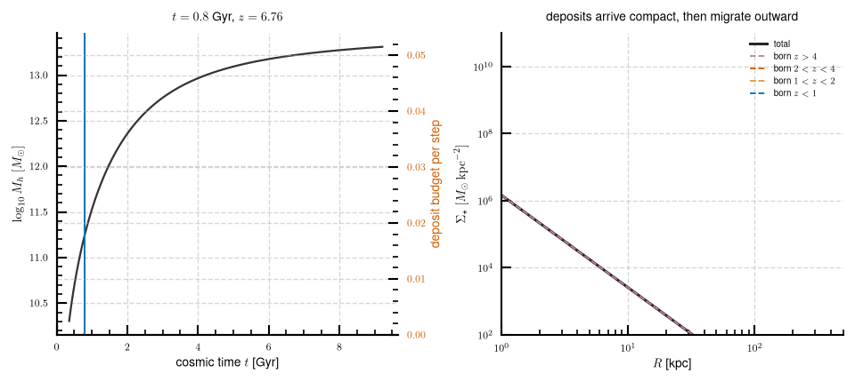
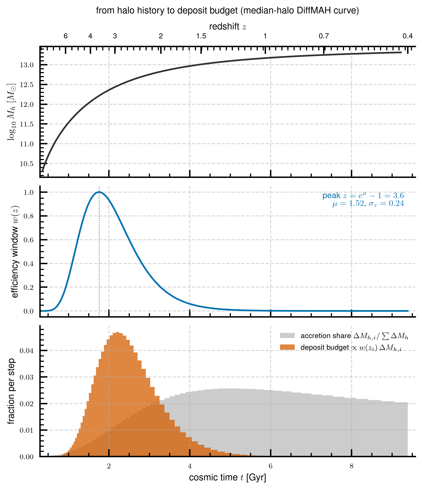
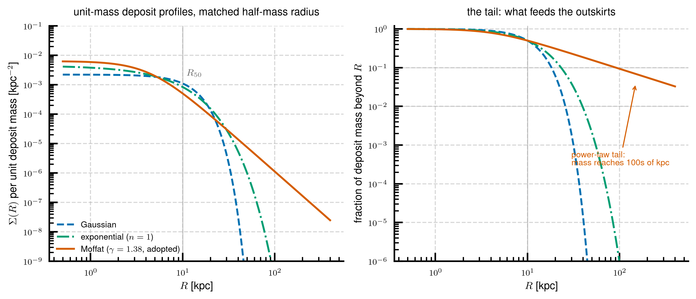
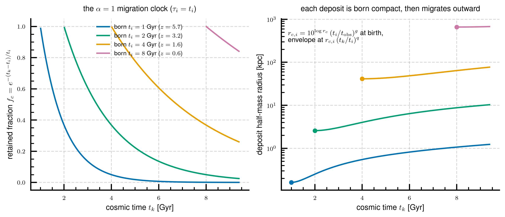
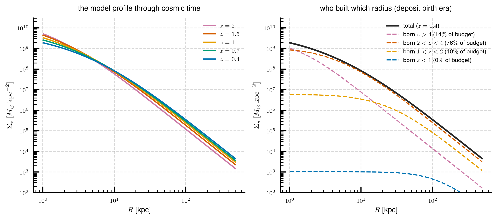
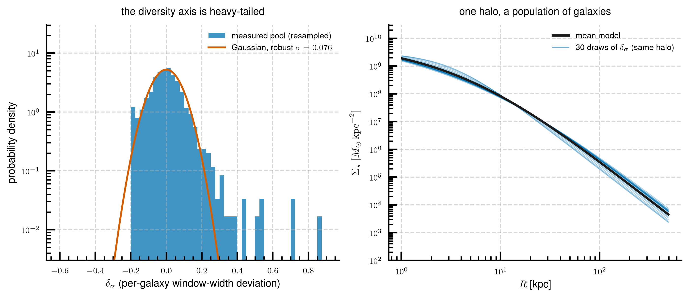

# Tech note 2 — The transport kernel (1ch-mof)

*A forward physical model: stars arrive with the halo's accretion, are
deposited compactly with a power-law tail, and migrate outward on a
dynamical clock. Twelve parameters shared by the whole population.*

The statistical emulator of [note 1](01_statistical_emulator.md) is the
accuracy and generative product. This note documents the second, complementary
model: the **transport kernel**, a mechanistic forward model that builds each
galaxy's stellar-mass profile *from its halo's accretion history* through an
explicit deposit-and-migrate process. Its accuracy is close to (but not at)
the statistical emulator's; its unique value is that it *passes out-of-model
physics tests* — it reproduces measured facts about where newly-added stellar
mass lands, facts it was never fitted to. It is the model you reason with,
where the statistical emulator is the model you predict with.

The adopted configuration is called **1ch-mof**: a *single channel* of
deposits with a *Moffat* (power-law-tail) profile. Its reference
implementation is `experiments/exp38_deposit_rethink/stage2_multiepoch.py`
(functions `basis_mof`, `model_cogs`, variant `"1ch-mof"`), with the adopted
parameter vector stored in
`experiments/exp40_epoch_objective/outputs/latestart.npz` under key
`theta_z15`. Its generative companion, the stochastic layer of §6, lives in
`experiments/exp41_stochastic_layer/stage2_draws.py` (`draw_deltas`,
`drawn_cogs`).

---

## 1. The model in one paragraph

Each step of the halo's mass accretion history delivers a parcel of stars.
A **lognormal efficiency window** in redshift decides how many (star
formation and stellar accretion are efficient only in a particular cosmic
era). Each parcel is **deposited** as a centrally-concentrated profile with
a power-law tail, at a compact **birth radius** that grows with cosmic
arrival time. From the moment it lands, a **migration clock** moves the
parcel's mass outward: the fraction still at its birth radius decays
exponentially with elapsed time (in units of the arrival time itself), the
rest sits in an envelope whose radius grows as a power of time. The
galaxy's curve of growth at any epoch is the sum of all parcels that have
arrived, and its normalization is pinned to the measured total mass within
500 kpc. Two of the parameters are (linearly) conditioned on the halo, so
the whole population shares one 12-parameter vector.

*Cosmic time runs. Left: the halo history (black), the deposit budget
arriving per step (orange bars), and the time cursor (blue). Right: the
stellar surface-density profile assembling — the total (black) and the
contribution of deposits grouped by birth era (dashed). Made with the
adopted parameters and an analytic median halo history
(`scripts/make_figures_note2.py`). In this toy the amplitude is normalized
once at the end; the real model pins each epoch to the measured
$M_\star(<500\,{\rm kpc})$.*

## 2. The ingredients, with equations

Throughout: $t_i$ is the cosmic arrival time of accretion step $i$ (with
redshift $z_i$), $t_k$ is the epoch at which we evaluate the profile,
$t_{\rm obs}$ is the $z=0.4$ anchor epoch (9.39 Gyr), and $R$ is projected
radius in kpc.

### 2.1 The deposit budget: a lognormal efficiency window

The halo's de-dipped main-branch history gives accretion steps
$\Delta M_{h,i}$. The stellar parcel of step $i$ is proportional to

$$
\mathrm{d}M_i \;\propto\; w(z_i)\, \Delta M_{h,i},
\qquad
w(z) \;=\; \exp\!\left[ -\,\frac{\big(\ln(1+z) - \mu\big)^2}{2\,
\sigma_z^2} \right],
$$

a lognormal window in $1+z$ with peak at $z_{\rm peak} = e^{\mu} - 1$. The
budget is normalized to sum to one over the history; the physical mass
scale enters only through the per-epoch normalization (§2.5).

Fitted values: $\mu = 1.52$, $\sigma_z = 0.24$, i.e. the window peaks at
$z \approx 3.6$ and has fallen to half by $z \approx 2.6$ and $z \approx
4.8$. The reading: the stars that end up in these massive centrals were
overwhelmingly brought in by halo growth at $z \sim 2.5$–5, even though
most of the *halo's* mass arrives later.

*Top: the median-halo DiffMAH history. Middle: the fitted window $w(z)$ on
the same time axis. Bottom: the halo's accretion share per step (grey) —
broad and late — against the resulting deposit budget (orange), which the
window concentrates at $t \approx 1.5$–4 Gyr ($z \approx 1.6$–4).*

### 2.2 The deposit shape: a power-law (Moffat) tail

Each parcel lands with a Moffat surface-density profile — a flat core with
a genuinely *power-law* outer tail,

$$
\Sigma_i(R) \;\propto\;
\Big( 1 + (R/r_{c,i})^2 \Big)^{-\gamma}
\qquad\Longleftrightarrow\qquad
\frac{M_i(<R)}{\mathrm{d}M_i} = 1 - \Big( 1 + (R/r_{c,i})^2
\Big)^{1-\gamma},
$$

with one shared tail index $\gamma$ (finite mass requires $\gamma > 1$;
fitted $\gamma = 1.38$, meaning $\Sigma \propto R^{-2.76}$ far out). The
tail index is the load-bearing choice of the whole model, and it was
forced by data, not taste:

- The *measured* stacked light added between adjacent epochs has Sérsic
  index $n \approx 2$–3 wings — nothing like a Gaussian ($n = 0.5$).
- Gaussian deposits, having no wings, could only supply outskirt light by
  inflating their width scale to its allowed bound (~1000 kpc) in every
  fit — a railed, unphysical compensation (this rail is the origin story
  of the two-channel alternative, [note 3](03_two_channel_alternative.md)).
- With the Moffat tail, a deposit with a scale radius of a few kpc still
  places percent-level mass at hundreds of kpc — the outskirts are fed
  *structurally*, and no parameter sits at a bound.

*Unit-mass deposits at the same half-mass radius (10 kpc here,
illustrative). Left: surface density. Right: the fraction of the deposit's
mass beyond $R$ — at 100 kpc the Gaussian retains essentially nothing,
the exponential $\sim 10^{-4}$, the Moffat several percent. That
difference is the entire outskirt budget.*

### 2.3 The birth radius

Parcels arriving later are born wider:

$$
r_{c,i} \;=\; 10^{\log r_c}\, \Big( \frac{t_i}{t_{\rm obs}}
\Big)^{g}.
$$

Fitted $\log r_c = 2.74$, $g = 4.00$: a parcel arriving at the window peak
($t_i \approx 1.8$ Gyr) is born with $r_c \sim 0.8$ kpc — genuinely
compact — while the (budget-starved) latest parcels would be born wide.
The $g$ value sits at its fitted box edge; a stress test that loosened the
box found the optimum settles just inside ($g = 4.37$) for a 0.1% loss
change with no observable moving — the rail is a box clipping a flat ridge,
not a pathology. (The same railed value *was* pathological in a different
fit scope; see §5.)

### 2.4 The migration clock

Deposited mass does not stay put. Each parcel is a two-state mixture: a
fraction $f_c$ still at its birth radius, the rest in a migrated envelope,

$$
B_i(R, t_k) \;=\;
f_{c,i}\, \frac{M(<R;\, r_{c,i})}{\mathrm{d}M_i}
\;+\;
\big(1 - f_{c,i}\big)\, \frac{M(<R;\, r_{w,i})}{\mathrm{d}M_i},
$$

with

$$
f_{c,i} = \exp\!\left( -\,\frac{t_k - t_i}{\alpha\, t_i} \right),
\qquad \alpha = 1,
\qquad
r_{w,i} = r_{c,i}\, \Big( \frac{t_k}{t_i} \Big)^{q},
\qquad q = 0.91 .
$$

The clock timescale is the arrival time itself ($\alpha = 1$, the
*self-similar* clock): a parcel that arrived at $t_i = 1$ Gyr has migrated
almost entirely by $z = 0.4$, one that arrived at 8 Gyr has barely started.
This $\alpha \approx 1$ came out of three independent fits before it was
frozen; attempts to replace the smooth clock with discrete merger-triggered
migration events performed strictly worse — the smooth clock *is* the
delay-averaged merger clock.

*Left: the retained fraction $f_c$ for parcels born at four cosmic times.
Right: each parcel's half-mass radius trajectory (dot = birth). Early
parcels are born sub-kpc compact and migrate outward by roughly
$(t_k/t_i)^{0.91}$; the late-born wide parcels carry almost no budget
(§2.1), so the galaxy is assembled by early, compact, since-migrated
material — deposition, then migration.*

### 2.5 The sum, and the $M(<500\,{\rm kpc})$ normalization

The model curve of growth at epoch $t_k$ is the budget-weighted sum over
arrived parcels, scaled to the *measured* total mass within 500 kpc at that
epoch:

$$
M_{\rm model}(<R,\, t_k) \;=\;
M_\star^{500}(t_k)\;
\frac{\sum_{t_i \le t_k} \mathrm{d}M_i\, B_i(R, t_k)}
     {\sum_{t_i \le t_k} \mathrm{d}M_i\, B_i(500, t_k)} .
$$

Why 500 kpc, and why is this a big deal: an earlier generation of this
model was normalized *per epoch inside the 148-kpc measurement aperture* —
which let the optimizer "delete" inconvenient mass by pushing deposits past
the aperture horizon, invisibly and for free. Deposits at 550–19,000 kpc
widths are observationally identical to zero efficiency. Pinning instead to
$M_\star(<500\,{\rm kpc})$ — extrapolated from validated power-law tail
fits to each galaxy's profile, so the beyond-aperture mass is a *datum* —
makes the aperture fraction $M(<148)/M(<500)$ a fitted prediction and
closes the deletion channel. A model whose selling point is mass
conservation must not be normalized inside an aperture it can leak past.

### 2.6 Halo conditioning

Two of the six kernel parameters carry linear slopes on the standardized
halo vector $[\log M_h,\ c_{200c},\ f_{z2}]$, where $f_{z2} =
M_h(z{=}2)/M_h$ is an epoch-matched formation-time summary:

$$
\log r_c \to \log r_c + \mathbf{s}_{r} \cdot \hat h,
\qquad
\sigma_z \to \sigma_z + \mathbf{s}_{\sigma} \cdot \hat h .
$$

The fitted slopes are small but real; the qualitative content is that more
massive halos assemble their stars over a broader redshift span (the
window widens with $M_h$). Everything else — the clock, the tail index,
the migration exponent, the window peak — is one global number for the
whole population.

## 3. The twelve parameters

| # | symbol | role | fitted value (official scope, §5) |
|---|---|---|---|
| 1 | $\log r_c$ | birth-radius scale at $t_{\rm obs}$ [log kpc] | 2.74 |
| 2 | $g$ | birth-radius growth with arrival time | 4.00 |
| 3 | $q$ | envelope migration exponent | 0.91 |
| 4 | $\mu$ | efficiency-window peak, $\ln(1+z)$ | 1.52 (peak $z=3.6$) |
| 5 | $\sigma_z$ | efficiency-window width | 0.24 |
| 6 | $\gamma$ | Moffat tail index | 1.38 |
| 7–9 | $\mathbf{s}_{r}$ | $\log r_c$ slopes on $[\hat M_h, \hat c_{200c}, \hat f_{z2}]$ | $-0.02, -0.01, 0.00$ |
| 10–12 | $\mathbf{s}_{\sigma}$ | $\sigma_z$ slopes on the same | $+0.07, +0.02, +0.02$ |

The clock exponent $\alpha = 1$ is frozen (it fitted to $\approx 1$
repeatedly before freezing). Twelve numbers, ~2,400 galaxies, five epochs.

*Left: the model profile of the median halo at the five anchor epochs —
compact at $z=2$, growing outward toward $z=0.4$ as migration proceeds and
later (wider-born) parcels arrive. Right: the $z=0.4$ profile decomposed by
deposit birth era: the $2<z<4$ parcels (76% of this halo's budget)
dominate everywhere; the $z>4$ parcels have fully migrated into the core
region; $z<1$ arrivals are negligible — the window has closed.*

## 4. What the kernel is judged on: the physics tests

The kernel's held-out *accuracy* is measured the same way as the
statistical emulator's (shape error of the reconstructed CoG). But its
purpose is the **out-of-model tests** — measured population facts it is not
fitted to:

1. **Differential deposition.** Between adjacent epochs, what fraction of
   each galaxy's mass growth inside 148 kpc lands beyond 50 / beyond 100
   kpc? Measured (massive tercile, $z=0.7 \to 0.4$): 0.37 / 0.11. The
   adopted kernel: 0.40 / 0.13 — the best pass in the program's history,
   and it tracks the measured curve at every epoch pair.
2. **Outskirt residuals by mass.** The median model$-$data log
   surface-density offset at 30–60 and 60–148 kpc, in three stellar-mass
   terciles. The adopted kernel sits at $+0.03$/$+0.03$ dex in the lowest
   tercile (its worst cell) with the others at the $\pm 0.02$ level — flat
   residuals, no compensating undershoot.
3. **The aperture fraction.** $M(<148)/M(<500)$ versus stellar mass — a
   *prediction* under the 500-kpc normalization — matches the data to
   0.004–0.016 dex.

These tests are the reason the kernel exists. A long line of measured
alternatives — objectives that reward the inner mass, added core
components, retention floors — all bought accuracy *at the price of
breaking test 1*, and were therefore not adopted.

## 5. The fit scope: official at $z \le 1.5$

The kernel's assumptions are collisionless: stars arrive and are
transported, but never form dissipatively in place. At $z \gtrsim 1.5$ some
of these galaxies still form stars and mergers can be gas-rich — a regime
the model does not describe. Fitting the kernel *through* that era taxes
it: the joint five-epoch fit drains the $z=0.4$ core (the inner-mass
deficit reaches $-12\%$ in $M_\star(<5\,{\rm kpc})$, against a
population-sharing floor of $\approx -8\%$ that no shared-parameter model
can cross).

The adopted answer is a **fit-scope decision, not a model change**: the
official parameters are fitted jointly to the four epochs $z = 0.4, 0.7,
1.0, 1.5$ only. Consequences, all measured:

- Held-out accuracy on the fitted epochs is unchanged (median worst-radius
  shape error 18.2/17.4/16.6/16.4% from $z=0.4$ to $1.5$, versus
  18.5/17.6/16.7/16.2% for the five-epoch fit).
- The inner deficit improves to $-9.5\%$ (held-out $M_\star(<5\,{\rm
  kpc})$ at $z=0.4$), reaching most of the way to the sharing floor.
- The physics *improves*: differential deposition 0.40/0.13 vs data
  0.37/0.11; the low-mass outskirt residual halves.
- **$z = 2.0$ becomes a pure extrapolation diagnostic.** The kernel is
  evaluated there but never fitted there; it costs only +1.2 shape points
  over the five-epoch fit (15.4% vs 14.2%), and — strikingly — the
  late-fitted transport predicts the $z=2 \to 1.5$ differential-deposition
  pair *better* than the fit that was trained on it (0.21/0.06 vs
  0.18/0.05; data 0.23/0.06). Every standard QA table carries the $z=2.0$
  column under this label: it is the honest probe of the dissipative era,
  not a fitted epoch.

The five-epoch fit remains available as a comparison option
(`experiments/exp38_deposit_rethink/outputs/stage2_multiepoch.npz`, key
`theta_1ch-mof`).

## 6. The stochastic layer: the kernel's generative companion

The kernel is deterministic: two galaxies with identical halo features get
identical profiles. The real population is not like that — at fixed halo,
galaxies differ. Measured on 2-D observational planes (e.g. $M_\star(<30)$
vs $M_\star(50\text{–}100)$, both in log), the deterministic kernel's
population is distinguishable from TNG's at 1.6–2.9× the *split-half
floor* — where the floor is the energy distance between two random halves
of the truth itself, so 1.0× means statistically indistinguishable from
real. (The energy distance is a nonparametric two-sample statistic over
the 2-D point clouds; we quote it *centered*, i.e. after removing the mean
offset, so it measures the population's shape and spread.)

### 6.1 One heavy-tailed axis

An anatomy of the kernel's per-galaxy individuality — refit one parameter
per galaxy, every parameter in turn — found that the six per-parameter
deviations are rank-correlated at $|\rho| \ge 0.92$: the kernel sees **one
underlying per-galaxy axis** through six degenerate coordinates. That axis:

- coincides with the galaxies' core-mass diversity (correlation 0.78–0.87
  with an independently-measured per-galaxy core fraction);
- is *feature-orthogonal* (Spearman $|\rho| \le 0.20$ against every halo
  feature) — it is genuinely per-object information, not missed
  conditioning;
- is **heavy-tailed**: expressed as a deviation $\delta_\sigma$ of the
  efficiency-window width $\sigma_z$, its distribution has robust scatter
  0.076–0.081 but Student-$t$ tail weight (degrees of freedom 4–9) with
  strong positive skew. A Gaussian misses the extreme-diversity galaxies.

### 6.2 The adopted layer

The generative layer is deliberately minimal — **1-D empirical
resampling**:

$$
\sigma_z^{(n)} \;=\; \mathrm{clip}\Big( \sigma_z + \delta^{(n)},\ \text{
physical box} \Big),
\qquad
\delta^{(n)} \sim \big\{ \delta_j - \bar\delta \big\}_{j=1}^{N},
$$

i.e. per drawn galaxy, add one deviation resampled from the *measured,
mean-centered* pool of per-galaxy deviations (stored in
`experiments/exp41_stochastic_layer/outputs/stage1_dist.npz`), clipped to
the physical parameter box (~2% of draws touch the box). Mean-centering
guarantees the mean model is untouched (verified: drawn-parameter mean
offsets ~0.002–0.005). Resampling rather than a fitted Gaussian is a
measured choice: the Gaussian variant is uniformly equal-or-worse on every
plane — the heavy tails carry real population signal. A second axis (a
$\delta_q$ on the migration exponent) was tested and adds nothing while
straining the outskirt physics; 1-D is the smallest sufficient
dimensionality.

*Left: the measured deviation pool against a Gaussian of the same robust
width (log scale) — the positive tail is the point. Right: thirty draws of
$\delta_\sigma$ applied to the same median halo: one halo becomes a family
of galaxies, tighter in the core, fanning out in the outskirts. The
deviation acts on the window width, so it is size-and-concentration
diversity — the model-side face of the population's observed
self-similarity in $R/R_{\rm half}$ units.*

**Scorecard** (held-out: the pool is calibrated on one half of the sample
and applied to the other): the drawn populations reach 1.0–1.1× the
split-half floor at $z = 0.4$ on the kpc planes (from the mean model's
1.6×) — the first kernel-based drawn population to reach the floor —
1.3–1.4× at $z = 0.7$, degrading to ~2.6–2.8× at $z = 2$ where the residual
is the *mean* model's ridge error (extrapolation era), which no scatter
layer can fix. Physics stays inside the adopted band (differential
0.40/0.12; low-mass outskirt residual $+0.03$ dex).

**A scoring-convention warning that cost us two weeks:** effective-radius
(Re-based) metrics must be computed *self-consistently* for draws — truth
masses through truth sizes, drawn masses through drawn sizes. Applying the
truth galaxy's half-mass radius to a drawn galaxy (the correct convention
for a *mean* prediction) structurally punishes a draw for being
independent of the specific truth realization, and made the layer look
like it degraded the Re plane (2.7× floor) when it is actually *at* the
floor (1.0–1.4× at every epoch) under self-consistent apertures. Paired
metrics for mean predictions; population metrics for draws.

**The standardized QA figure set** for the adopted operating point (the
official $z \le 1.5$ kernel as the mean model, overlaid with drawn
populations from this layer; the $z=2.0$ column labeled as extrapolation,
§5) is the `qa_*_exp41_kernel_layer.*` set in
`experiments/exp41_stochastic_layer/figures/` — seven figures: kpc and
$R_e$ aperture/annulus masses truth-vs-model, halo-mass-binned residuals,
the 2-D observational planes with energy/floor scores, and the best/worst
case gallery. Experiment figures are gitignored; regenerate with
`PYTHONPATH=. uv run python
experiments/exp41_stochastic_layer/stage2_draws.py report`.

## 7. Differentiability and the real-MAH input

The history the kernel consumes is the **smooth DiffMAH reconstruction**
of each halo's peak-mass curve (note 1, §2), sampled on ~99 evenly-spaced
time steps — *not* the raw simulation history. This is a measured choice,
and the raw-versus-DiffMAH comparison was run head-to-head at two levels
with opposite outcomes:

- **Per-galaxy fits: the real MAH is the honest input.** The smooth curve
  erases merger bursts (real single-step halo growth reaches 7–18% of the
  total, versus 2–3% for the fit) and *flatters* the model: swapping in
  the real de-dipped peak history raised the per-galaxy joint multi-epoch
  worst-radius error from 4.4% to 6.1% (measured on the Gaussian-deposit
  generation of the model).
- **Population-shared fits — the regime this kernel lives in: DiffMAH
  wins.** With one shared parameter vector, the DiffMAH input is
  consistently better held-out: 30.4% versus 35.2% epoch-averaged
  worst-radius error ($n = 2397$, 10-fold CV, again on the earlier model
  generation). The smooth, regular deposit basis suits a global theta;
  the bursty, gappy real history demands per-galaxy adaptation a shared
  fit cannot provide.
- **The real MAH's one virtue** was population *diversity*: its drawn
  populations had the most realistic spread (centered plane energy 3.5×
  the split-half floor, the era's best) but a badly biased amplitude and
  worse accuracy at every tier and mass quartile. That diversity job is
  now done, differently, by the stochastic layer (§6).
- **Caveat:** these head-to-heads predate the Moffat deposit; the adopted
  1ch-mof has only ever been fitted in the DiffMAH configuration. The
  population-level verdict held across three model generations, but for
  1ch-mof specifically it is an (unverified, likely-safe) extrapolation.

The DiffMAH input also buys **differentiability**. The whole forward map
— the sigmoid-rolled power law $M_h(t)$, the accretion differences on a
fixed grid, the window $w(z)$, the Moffat curve of growth, the birth and
migration power laws, the clock exponential, the linear conditioning, the
normalization ratio, the relative-RMS loss — is a composition of smooth
analytic operations; the only non-smooth points are clip guards and the
quadratic hinge box penalty (piecewise-differentiable), and the epoch
mask $t_i \le t_k$ is fixed by the snapshot grid, not by parameters. A
JAX port is therefore mechanical, and would enable gradient-based
population fits (the current fits use derivative-free Nelder–Mead over
hours), Hamiltonian Monte Carlo posteriors over theta, and inverse
problems — gradients flow all the way back to the four DiffMAH numbers,
so a halo's assembly history can be inferred from an observed profile, or
the kernel embedded in the Diffmah/Diffstar family of differentiable
forward models. Two caveats: the real-MAH configuration would forfeit
exactly this (a measured history is data — theta-gradients survive,
history-gradients do not); and the stochastic layer resamples an
empirical pool, which as additive reparameterized noise passes
theta-gradients through but has no differentiable density — if one is
ever required, a Student-$t$ fit to the pool (measured tail weight:
4–9 degrees of freedom) is the natural candidate, at the cost of
re-running the plane checks (the Gaussian variant is measurably worse;
a $t$ is untested).

## 8. Honest limits

- **The population-sharing wall.** Even fitted to $z=0.4$ alone, a
  12-parameter shared kernel under-predicts $M_\star(<5\,{\rm kpc})$ by
  $\approx -8\%$: galaxy-to-galaxy core diversity plus a cuspier inner
  shape than any shared deposit sum reproduces. Only per-object freedom
  crosses that wall; the statistical emulator (whose per-galaxy inner-mass
  bias is 1–2%) is the product for observation-facing masses.
- **$z \ge 1.5$ is extrapolation** (§5): the dissipative era is
  diagnosed, not modeled.
- **Parameter values are physical only in the adopted basin.** The loss
  surface has observationally-equivalent basins that trade physics for
  loss (§4); every rail was stress-tested before being read. Treat the
  numbers in §3 as the adopted operating point, not as uniquely-determined
  physical constants.

---

*Previous: [note 1](01_statistical_emulator.md) — the statistical
emulator. Next: [note 3](03_two_channel_alternative.md) — the two-channel
alternative, and why the heavy tail made it unnecessary.*
