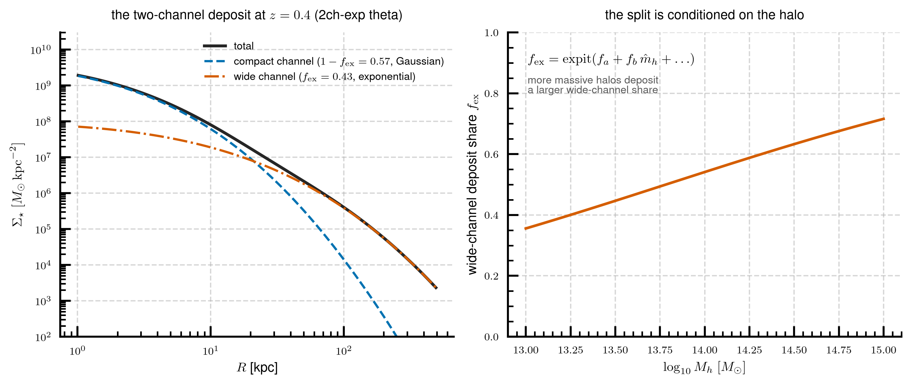
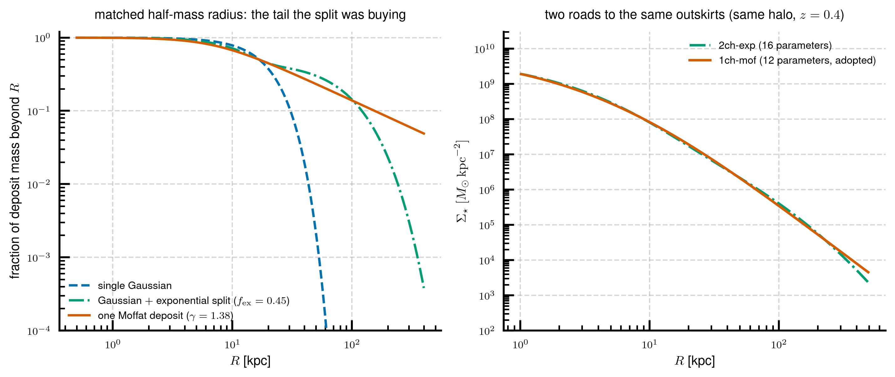

# Tech note 3 — The two-channel alternative (2ch-exp)

*Split every deposit into a compact channel and a wide channel: the natural
first fix for the missing outskirt light — presented as its own model, and
then the reason it was superseded.*

> **Status.** 2ch-exp is a documented **alternative**, not the adopted
> kernel. It was fitted once, at the joint five-epoch scope
> ($z = 0.4$–$2.0$), and was **never adopted and never re-fitted at the
> official $z \le 1.5$ scope** of [note 2](02_transport_kernel.md). It
> remains the accuracy pick *if* a two-channel architecture were ever
> required. Its fitted parameters live in
> `experiments/exp38_deposit_rethink/outputs/stage2_multiepoch.npz`, key
> `theta_2ch-exp`; the implementation is the `"2ch-exp"` variant in the
> same experiment's `stage2_multiepoch.py`.

This note assumes note 2's machinery: the deposit budget from the lognormal
efficiency window, the birth-width law, the $\alpha = 1$ migration clock,
the $M_\star(<500\,{\rm kpc})$ normalization, and the halo-conditioning
pattern are all identical here. What changes is the *shape of a deposit*.

---

## 1. Why a second channel was the natural move

The first-generation kernel deposited **Gaussians**. A Gaussian has no
wings: beyond a few scale lengths its mass vanishes faster than
exponentially. Massive galaxies, however, demonstrably grow *outskirt*
light — of the mass a massive galaxy adds between $z=0.7$ and $z=0.4$
inside 148 kpc, a measured 37% lands beyond 50 kpc and 11% beyond 100 kpc.
A Gaussian deposit can only supply that light by inflating its width scale
— and that is exactly what every fit did: the width-scale parameter railed
at whatever upper bound it was given, up to ~1000-kpc deposit scales,
buying loss by pushing mass past the normalization horizon rather than by
describing the data. A bounds-stress test confirmed the rail was
*load-bearing*: the freedom was spent on horizon escape, not on the
measured observables.

When a parameter compensates structurally, the fix is a structural degree
of freedom. The obvious candidate mirrors the standard picture of galaxy
assembly — stars formed in the galaxy versus stars accreted from
satellites: **split each deposit into two channels**, a compact one and a
wide one, with a halo-dependent share. The wide role moves into a channel
that carries only part of the mass, so the compact channel's width law can
go narrow instead of railing.

## 2. The model

Each accretion step's parcel is split between two co-moving channels that
share the migration structure (same $g$, same $q$, same $\alpha = 1$
clock) and differ only in profile and width scale:

$$
B_i(R, t_k) \;=\;
\big(1 - f_{\rm ex}\big)\, B^{\rm gauss}_i\big(R, t_k;\ \log s_0\big)
\;+\;
f_{\rm ex}\, B^{\rm exp}_i\big(R, t_k;\ \log s_{0,\rm ex}\big),
$$

- the **compact channel** keeps the Gaussian deposit,
  $M(<R) \propto 1 - e^{-R^2/2s^2}$, at a narrow scale $\log s_0 = 2.25$
  (178 kpc at $t_{\rm obs}$, shrinking as $(t_i/t_{\rm obs})^{3.3}$ for
  earlier arrivals) — off the rails for the first time in the model
  family's history;
- the **wide channel** is an **exponential** profile (Sérsic $n = 1$),
  $M(<R) \propto 1 - (1 + R/a)\,e^{-R/a}$, at scale
  $\log s_{0,\rm ex} = 3.0$ — heavier-winged than a Gaussian at the same
  scale, and its preferred scale is *finite*: stress-testing the 3.0 box
  edge found an interior optimum at 3.19 with the observables unmoved (a
  box clipping a nearly-flat optimum, unlike the Gaussian era's
  load-bearing rail);
- the **split** is a logistic function of the standardized halo vector
  $\hat h = [\hat M_h, \hat c_{200c}, \hat f_{z2}]$,

$$
f_{\rm ex} \;=\; \mathrm{expit}\big( f_a + \mathbf{f}_b \cdot \hat h
\big),
$$

rising from $\approx 0.45$ at $\log M_h = 13$ to $\approx 0.75$ at
$\log M_h = 15$ — a free parameter landing, unprompted, on a plausible
accreted-fraction trend.

With the two conditioning rows inherited from the base model (on
$\log s_0$ and the window width $\sigma_z$), the model has **16
parameters**, versus 1ch-mof's 12.

*Left: the $z=0.4$ decomposition on the median halo at the fitted
parameters — a steep Gaussian compact channel and a flat exponential
envelope that takes over beyond ~20 kpc. Right: the fitted wide-channel
deposit share versus halo mass.*

**A label warning.** It is tempting to call the channels "in-situ" and
"ex-situ". The model does not earn those names: every deposit at every
epoch is split by the same halo-dependent fraction — there is no per-star
provenance and no merger delay — and with the window peaking at
$z \approx 3.3$–4, most of the deposited budget arrives from $z > 2$ and
is split like everything else. The mapping to simulation particle-origin
classifications is qualitative at both ends (the share's rise and
flattening with halo mass is broadly TNG-like, and that is the strongest
statement available). The channels are, precisely, *a compact profile
component and a wide profile component*.

## 3. What it achieves

At the five-epoch fit scope, judged held-out (10-fold cross-validation)
on the *pinned-shape error* — the median over galaxies of the worst-radius
absolute relative deviation of the model CoG, after scaling to the
measured 148-kpc mass, over $R > 5$ kpc:

| model | parameters | shape error by epoch ($z=0.4/0.7/1.0/1.5/2.0$) | epoch average |
|---|---|---|---|
| 2ch-exp | 16 | 17.8 / 17.0 / 16.4 / 15.8 / 14.5 % | **16.3 %** |
| 1ch-mof | 12 | 18.5 / 17.6 / 16.7 / 16.2 / 14.2 % | 16.6 % |

(For calibration: the purely statistical emulator's wall at $z=0.4$ is
15.6%, and the *incumbent* two-channel model that 2ch-exp refined sat at
16.4%.) So 2ch-exp is the **accuracy pick** among the deposition kernels —
0.3 points better on average, best at $z = 1.5$.

It also passes the physics: differential deposition 0.39/0.14 against the
measured 0.37/0.11 (massive tercile, $z = 0.7 \to 0.4$), and the low-mass
outskirt residual at $+0.02$/$+0.06$ dex (30–60 / 60–148 kpc) — comparable
to its era's best.

Its standardized QA figure set (same layout as the adopted kernel's:
aperture/annulus masses per epoch, halo-mass-binned residuals, the
observational planes, the case gallery) is `qa_*_exp38_2ch-exp.*` in
`experiments/exp38_deposit_rethink/figures/`, alongside the matching
`qa_*_exp38_1ch-mof.*` set at the same five-epoch scope for a like-for-like
comparison. Experiment figures are gitignored; regenerate with
`PYTHONPATH=. uv run python
experiments/exp38_deposit_rethink/stage2_multiepoch.py report`. (Note both
sets are the *five-epoch* fits — the adopted kernel's current QA at its
official $z \le 1.5$ scope is the exp41 set of note 2, §6.)

## 4. Why the single heavy tail supersedes it

The exp38 shape shootout asked a sharper question: is the *split* the
right structure, or was it compensating for the wrong *deposit shape*? Two
single-variable surgeries on the same machinery answered it:

- swap the wide channel's Gaussian for an exponential → 2ch-exp (this
  note): the rail pathology disappears, accuracy improves;
- **remove the split entirely** and give the *single* channel a power-law
  tail → 1ch-mof (note 2): the rail pathology disappears, accuracy is
  within 0.3 points, and the physics tests come out *cleaner* (differential
  0.39/0.12, the best pass in the program; outskirt residuals flat at
  every mass tercile, where 2ch-exp keeps a mild massive-end undershoot).

*Left, at the deposit level: the mass fraction beyond $R$ for a single
Gaussian, for the Gaussian $+$ exponential split, and for one Moffat
deposit at the same half-mass radius — the split grafts a wing onto the
Gaussian; the Moffat has the wing built in, and keeps feeding mass beyond
the exponential's own cutoff. Right, at the full-model level: the two
fitted kernels produce nearly the same $z=0.4$ profile on the same halo —
two roads to the same outskirts, one of them four parameters shorter.*

The pedagogical beat, stated plainly: **the two-channel split was a fix
for the missing outskirt light, and the missing light was a symptom of the
deposit shape, not evidence for two populations of deposits.** Once a
single deposit carries a power-law tail, the split has nothing left to
buy: the extra channel costs four parameters, an extra width scale living
at a box edge, and an interpretability temptation (the in-/ex-situ
labels) that the model cannot honor. The user decision (2026-07-16)
adopted the single-channel 1ch-mof on exactly these grounds — fewer
parameters, no bound anywhere, the cleanest physics — and 2ch-exp was
archived as the documented alternative without a $z \le 1.5$ refit.

## 5. If you ever need it

Situations that would revive 2ch-exp: a hard requirement to *tag* profile
components (e.g. to compare against particle-origin classifications in a
hydro simulation, after validating the labels), or evidence that a single
tail index cannot serve both the compact and extended parts of some new
population. In that case: re-fit at the current official scope first
(the archived theta is a five-epoch fit; note 2 §5 showed the scope
choice moves both the inner masses and the physics), and re-run the
bounds-stress protocol on the wide scale before reading it.

---

*Previous: [note 2](02_transport_kernel.md) — the adopted transport
kernel. Index: [README](README.md).*
