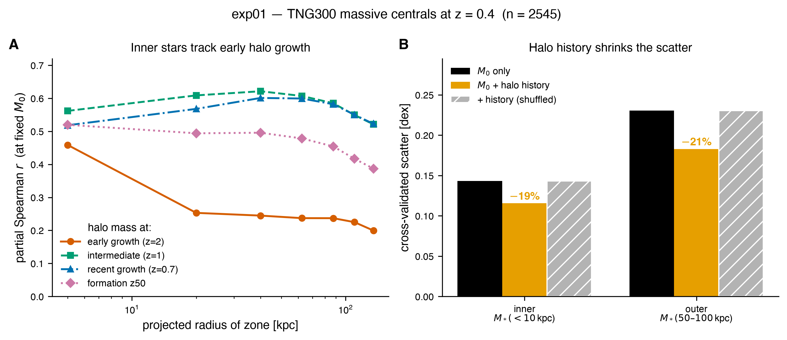
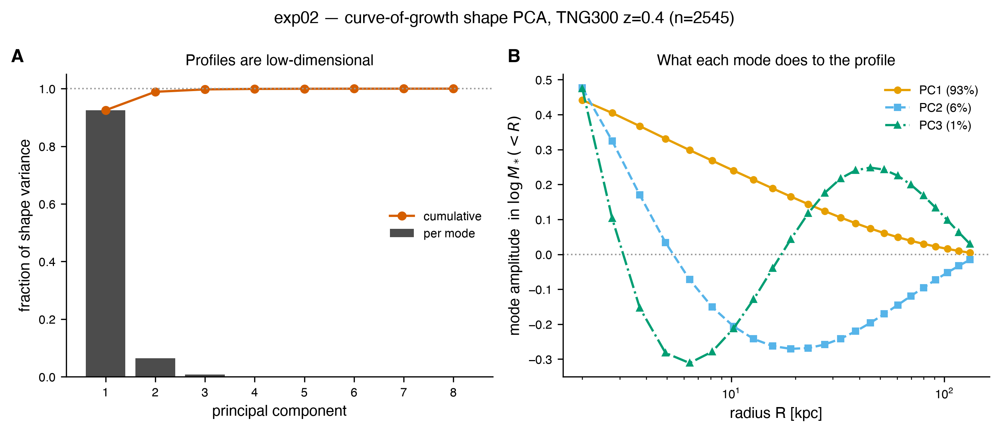
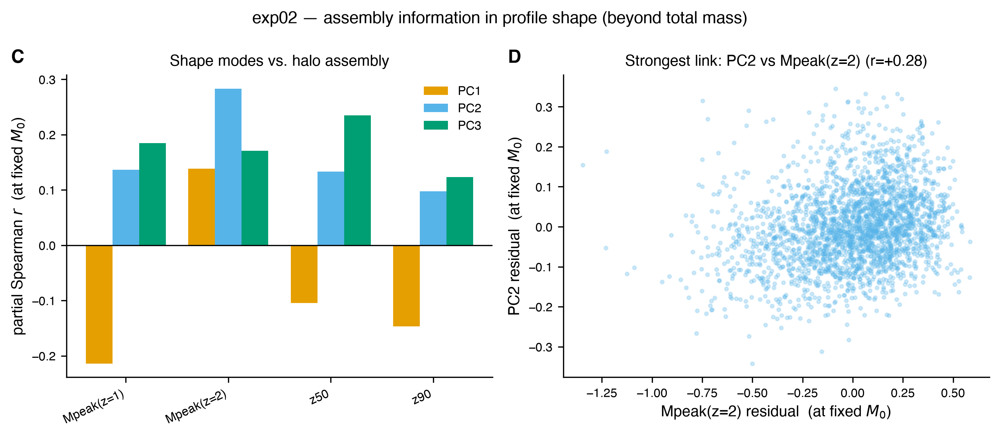
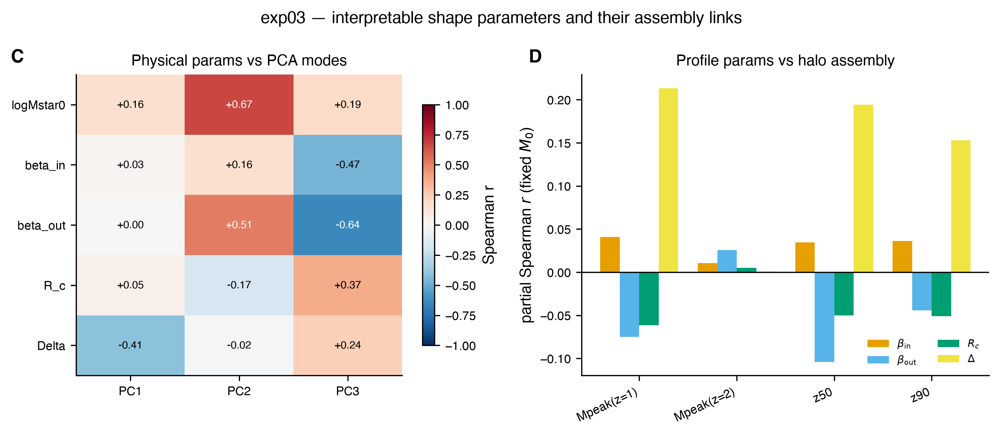
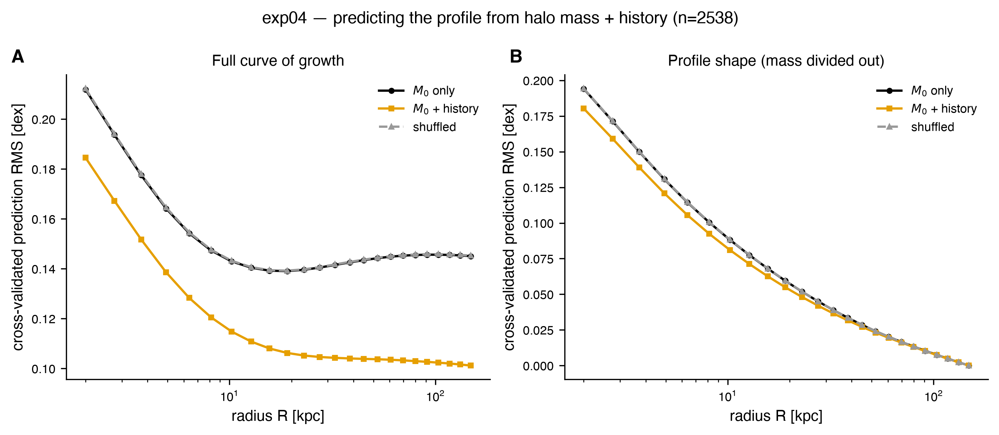
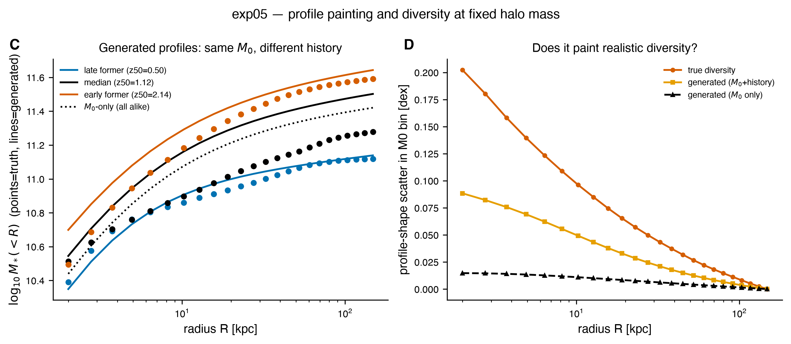

# Ultimate SHMR — Results Summary (exp01–exp05)

**Status:** first results milestone, TNG300-1 at z = 0.4.
**Companions:** `ultimate_shmr_context.md` (motivation), `ultimate_shmr_possible_directions.md` (plan), `tng300_data.md` (data).

This report synthesizes the first five experiments, which together build and
validate a first-generation **Ultimate SHMR**: a model that maps a dark-matter
halo's mass and assembly history to the stellar mass profile of its central
galaxy. The headline: **at fixed final halo mass, a halo's growth history carries
real, physically-structured information about its central galaxy's light
profile — enough to predict the full profile ~20% better than halo mass alone
and to "paint" about half of the true galaxy-to-galaxy profile diversity.**

---

## 1. Question and approach

The classical stellar–halo mass relation links two scalars, `M_star` and
`M_halo`. The Ultimate SHMR replaces them with two richer objects: the halo's
**mass assembly history** (MAH) and the galaxy's full **stellar mass profile**.
The controlled, falsifiable question driving every experiment:

> At fixed final halo mass `M0 = Mpeak(z=0.4)`, does the main-branch assembly
> history improve the prediction of the central galaxy's stellar profile — and
> is any improvement physically structured rather than a statistical artifact?

Three methodological pillars recur:
- **Control for final mass** via partial (rank) correlation, isolating assembly
  information *beyond* `M0`.
- **Cross-validation** (5-fold) for every predictive claim.
- **A shuffle control**: permute histories among same-`M0` halos; a real signal
  must vanish. (It does, in every experiment.)

## 2. Data and methods

- **Sample:** 3388 massive halos (`Mpeak(z=0.4) > 10^13 Msun`) from TNG300-1,
  snapshot 72 (z = 0.4). After quality cuts (valid profile, reliable & still-
  rising `M0`, finite curve of growth) the clean analysis sample is **2545
  galaxies** (2538 with all MAH summaries finite).
- **Galaxy side:** projected stellar mass curve of growth `M_star(<R)` on 24 log
  radii (2–148 kpc) and 7 aperture masses, all at z = 0.4.
- **Halo side:** `Mpeak(z)` at z = 0.4/0.7/1/1.5/2 and formation redshifts
  z50/z75/z90, from the main-branch MAH.
- **Caveats baked in:** `M0` is the peak mass at the latest available snapshot
  (~z = 0.42, not exactly snap 72); profiles are single random 2-D projections of
  triaxial galaxies (irreducible noise); the MAH is only part of the halo
  information (secondary properties not yet included). See §6.

Code lives in the `hongshao/` library (`tng_data`, `profiles`, `stats`,
`plotting`); each experiment is a self-contained folder under `experiments/`.

---

## 3. The five experiments

### exp01 — Which radial zones remember which epochs of halo growth?

*Aperture/zone stellar mass vs `Mpeak(z)` at fixed `M0` (partial correlation),
plus cross-validated scatter reduction.*

- Adding history cuts the prediction scatter of **inner** `M_star(<10 kpc)` by
  **19.4%** (0.143 → 0.116 dex) and **outer** `M_star(50–100 kpc)` by **20.6%**
  (0.230 → 0.183 dex). Shuffle control ≈ 0%.
- The signal is radially structured: the **innermost zone uniquely tracks early
  halo mass** (`Mpeak(z=2)`, r = 0.46), and that early-time sensitivity falls by
  ~2× outward (r = 0.20 at 120–150 kpc). Recent growth (z ≲ 1) governs all radii.



**Takeaway:** the two-phase assembly picture is visible — inner stars set down
early, outer envelope built later — and history measurably helps at fixed mass.

### exp02 — How few numbers describe a profile, and do they carry assembly?

*Covariance PCA of the mass-normalized curve-of-growth shape.*

- Profile shape is **~2–3 dimensional**: PC1 = 92.5%, PC2 = 6.4%, PC3 = 0.8%;
  two modes reconstruct the curve of growth to 0.010 dex, three to 0.005 dex.
- PC1 = overall **concentration** (tracks total mass, r = −0.56). The
  *sub-dominant* shape modes carry assembly memory at fixed `M0`: **PC2 ↔ early
  growth** (`Mpeak(z=2)`, r = +0.28), **PC3 ↔ formation time** (z50, r = +0.23).




**Takeaway:** profiles live in a tiny space; assembly information sits in the
fine shape structure, not the dominant concentration mode.

### exp03 — An interpretable 5-number profile model (radial-DiffMAH)

*Fit each curve of growth with a DiffMAH-style radial model: inner slope, outer
slope, transition radius `R_c`, transition width `Delta`, normalization.*

- Five physical parameters fit **every** profile to a median **0.005 dex**
  (matching PCA-3) — a **single sigmoid is enough**, no two-component model
  needed at z = 0.4.
- The parameters are a rotated basis of the PCA modes. Assembly memory at fixed
  `M0` concentrates in the **transition width `Delta`** (r ≈ 0.21 with
  `Mpeak(z=1)` and z50); individually a touch weaker than PCA's best direction
  (0.28), i.e. the assembly fingerprint is a *combination* of parameters.



**Takeaway:** we have an interpretable, near-lossless 5-number profile
description — the chosen parameterization for the model.

### exp04 — First halo→profile model: `P(profile | M0, history)`

*Cross-validated linear prediction of the full 24-point curve of growth.*

- Adding history improves full-profile prediction by **22.6%** (0.152 → 0.118
  dex; shuffle ≈ 0); pure shape by **7.3%**.
- The absolute-mass gain **grows with radius** (13% in the center → ~30% at
  150 kpc): history is especially good at predicting outer/total mass.
- "Painting" works: same-`M0` halos with different histories get different
  predicted profiles, with **early-forming halos more extended** — consistent
  with Pillepich et al. (2014).



**Takeaway:** the core relation generalizes from apertures to the whole profile.

### exp05 — Generative profile-painting model

*Predict the 5 radial-DiffMAH parameters from halo features, then reconstruct a
guaranteed-valid (monotonic) profile.*

- Generating via 5 parameters reaches **0.128 dex** (vs 0.118 for direct
  point prediction — the compression costs ~0.01 dex); history improves it
  **19.8%**. It helps the normalization most (+13%), then `Delta` (+3.5%).
- **The generator paints ~45% of the true diversity:** at fixed halo mass it
  reproduces ~0.09 of the ~0.20 dex true profile-shape scatter at small radii,
  versus ~0 for a mass-only model.



**Takeaway:** a working end-to-end generative model that recovers about half the
intrinsic profile diversity from assembly history alone.

---

## 4. What we have learned (synthesis)

1. **Massive-galaxy profiles are low-dimensional.** At z = 0.4 they are captured
   by ~2–3 PCA modes or 5 interpretable radial-DiffMAH parameters to ~0.005 dex.
2. **Assembly history carries real, shuffle-confirmed information beyond final
   halo mass** — ~20% scatter reduction for apertures (exp01) and for the full
   curve of growth (exp04), and a working generative model (exp05).
3. **The information is physically structured**, matching the two-phase picture:
   inner stars remember early halo growth, outer stars track recent growth;
   early-forming halos host more extended galaxies at fixed mass.
4. **The assembly signal lives in profile *shape*, in sub-dominant modes / a
   combination of parameters** (PC2/PC3, transition width) — not in overall mass
   or concentration, which are governed by `M0` itself.
5. **History deterministically explains roughly half the profile-shape
   diversity** at fixed mass (exp05); the remainder is intrinsic scatter.

This is concrete first evidence for an assembly-resolved, profile-level extension
of the SHMR — the project's founding hypothesis.

## 5. Magnitudes in context

The correlations are modest (partial r ≤ ~0.28; ~7% shape-scatter reduction) and
this is *expected*, not a shortfall:
- the main-branch MAH is only part of the halo information (secondary properties
  such as concentration / tidal field are not yet included);
- the profiles are single random projections of triaxial galaxies, injecting
  noise that no halo model can remove from this dataset.

So the measured signal is a **lower bound** on the assembly information, and the
~45% diversity recovered by the mean model sets a floor that a probabilistic
model and secondary properties can push further.

## 6. Caveats and limitations

- `M0` is a snap-71 proxy (the exact snap-72 `mass_halo` is not in the data drop).
- Single-projection / triaxiality noise is irreducible here.
- Models so far are linear *mean* predictors — no scatter modeling yet.
- Single redshift (z = 0.4); no evolution tested.
- DiffMAH/Diffstar fits are not yet linked to the sample (missing `halo_id`
  cross-match), so secondary halo properties are not yet available.

## 7. What's next

- **Probabilistic emulator** — model the residual scatter so painted mocks have
  the *full* realistic diversity, not just the mean (directly motivated by
  exp05's ~45%).
- **Secondary halo properties** (concentration / tidal field) — quantify how much
  more they explain; needs the `halo_id` cross-match.
- **Redshift evolution** — once profiles at other epochs are available.
- **Mock painting on an N-body catalog** — the end-goal application.

## Appendix — reproduce

```bash
uv run python -m hongshao.tng_data --full --out data/processed/tng300_072_z0p4.fits
PYTHONPATH=. uv run python experiments/exp0N_*/run.py     # N = 1..5
```

Per-experiment details and figures live in each `experiments/exp0N_*/README.md`;
the roadmap and per-experiment status are in `doc/todo.md`. Figures here are
copies of the headline panels and regenerate from the drivers.
